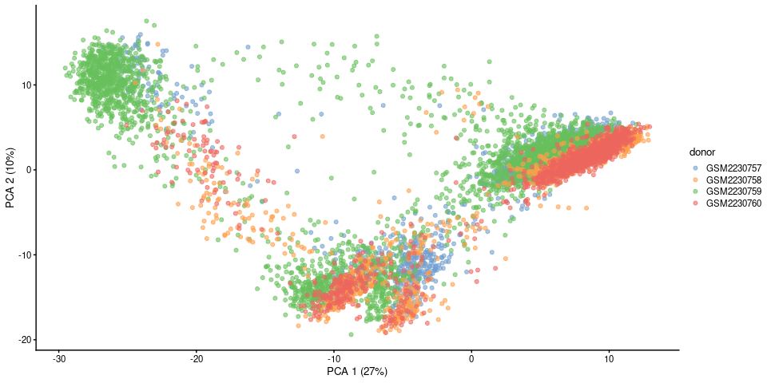
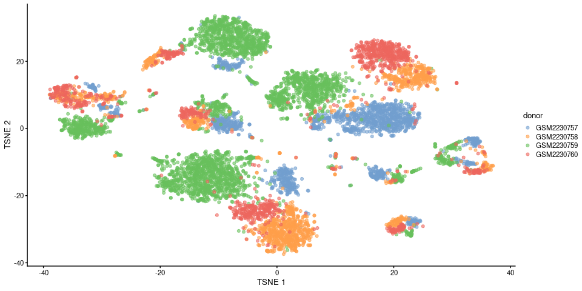
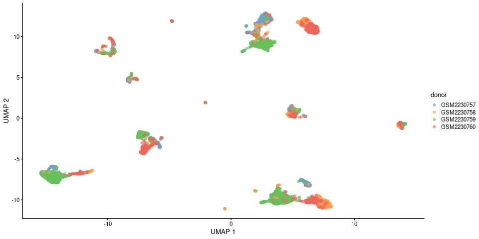
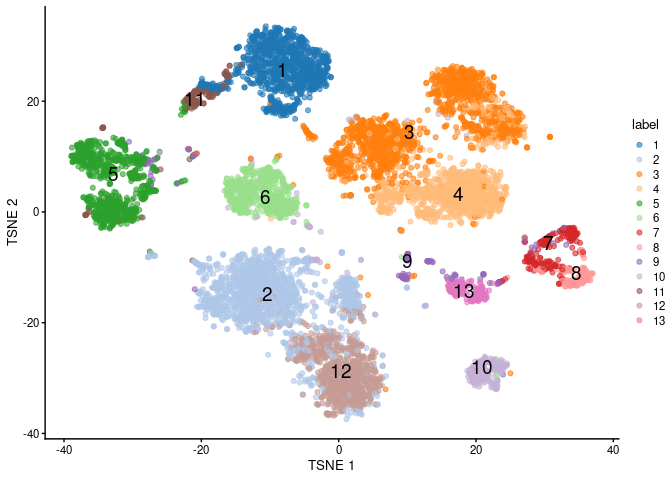
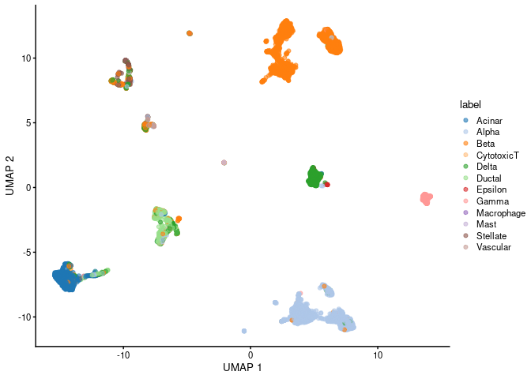

**NOTE**: Full HTML version of the report will floating table of contents is live at the following link: [https://jakesauter.github.io/Single_Cell_Seq_Processing/](https://jakesauter.github.io/Single_Cell_Seq_Processing/)


**Reference Used**

[HBC Training resource referenced throughout this assignment.](https://hbctraining.github.io/scRNA-seq/lessons/04_SC_quality_control.html)

**Libraries Used**


```r
library(scran)
library(dplyr)
library(knitr)
library(scater)
library(tibble)
library(AUCell)
library(GSEABase)
library(pheatmap)
library(RColorBrewer)
```


## **Loading Data**

For this excercise, we will be using pancreas data from [Baron et al. (2016)](https://pubmed.ncbi.nlm.nih.gov/27667365/)


```r
baron.sce <- scRNAseq::BaronPancreasData('human')
```

In **Table S2** of the reference publication, Baron et. al identify Pancreas cell gene markers that we will make use of in this analysis.


```r
cell.markers <- 
  tibble(cell=c("Alpha", "Beta", "Delta", "Gamma","Epsilon", "Ductal", 
                "Acinar", "Stellate","Vascular", "Macrophage", "CytotoxicT", "Mast"),
         gene=c("GCG", "INS", "SST", "PPY", "GHRL", "KRT19" ,
                "CPA1" ,"PDGFRB", "VWF", "CD163", "CD3D", "TPSAB1" ))
```

In this analysis, we will also make use of additional pancreas data from [Grun etal. (2016)](https://pubmed.ncbi.nlm.nih.gov/27345837/)


## **Integrating Datasets**

**TODO: Chapter 13, dataset integration**


```r
# grun.sce <- scRNAseq::GrunPancreasData()
```

## **Annotating Gene Names**

**Note**: We have used the `AnnotationHub` package to annotate the genes here, though `Organism.dplyr` or `EnsDb.Hsapiens.v86` could also be used to perform this same task.


```r
library(AnnotationHub)

ens.GRCh38 <- AnnotationHub()[["AH73881"]]
```

* `columns` shows which kinds of data can be returned for the AnnotationDb object.
* `keytypes` allows the user to discover which keytypes can be passed in to select or keys and the keytype argument.
* `mapIds` gets the mapped ids (column) for a set of keys that are of a particular keytype. Usually returned as a named character vector.


```r
columns(ens.GRCh38)
```

```
 [1] "DESCRIPTION"         "ENTREZID"            "EXONID"             
 [4] "EXONIDX"             "EXONSEQEND"          "EXONSEQSTART"       
 [7] "GENEBIOTYPE"         "GENEID"              "GENEIDVERSION"      
[10] "GENENAME"            "GENESEQEND"          "GENESEQSTART"       
[13] "INTERPROACCESSION"   "ISCIRCULAR"          "PROTDOMEND"         
[16] "PROTDOMSTART"        "PROTEINDOMAINID"     "PROTEINDOMAINSOURCE"
[19] "PROTEINID"           "PROTEINSEQUENCE"     "SEQCOORDSYSTEM"     
[22] "SEQLENGTH"           "SEQNAME"             "SEQSTRAND"          
[25] "SYMBOL"              "TXBIOTYPE"           "TXCDSSEQEND"        
[28] "TXCDSSEQSTART"       "TXID"                "TXIDVERSION"        
[31] "TXNAME"              "TXSEQEND"            "TXSEQSTART"         
[34] "TXSUPPORTLEVEL"      "UNIPROTDB"           "UNIPROTID"          
[37] "UNIPROTMAPPINGTYPE" 
```


```r
keytypes(ens.GRCh38)
```

```
 [1] "ENTREZID"            "EXONID"              "GENEBIOTYPE"        
 [4] "GENEID"              "GENENAME"            "PROTDOMID"          
 [7] "PROTEINDOMAINID"     "PROTEINDOMAINSOURCE" "PROTEINID"          
[10] "SEQNAME"             "SEQSTRAND"           "SYMBOL"             
[13] "TXBIOTYPE"           "TXID"                "TXNAME"             
[16] "UNIPROTID"          
```


```r
baron.keys <- rownames(baron.sce)

baron.keys[1:10]
```

```
 [1] "A1BG"   "A1CF"   "A2M"    "A2ML1"  "A4GALT" "A4GNT"  "AA06"   "AAAS"  
 [9] "AACS"   "AACSP1"
```


```r
locations <- 
  mapIds(ens.GRCh38, 
         keys = baron.keys, 
         keytype = "GENENAME", 
         column = 'GENESEQSTART') 

chromosomes <- 
  mapIds(ens.GRCh38, 
     keys = baron.keys, 
     keytype = "GENENAME", 
     column = 'SEQNAME')

descriptions <- 
  mapIds(ens.GRCh38, 
         keys = baron.keys, 
         keytype = "GENENAME", 
         column = 'DESCRIPTION')

rowData(baron.sce) <-  
  data.frame(Gene_Name = baron.keys, 
             Gene_Location = locations, 
             Gene_Description = descriptions)
```

## **Filter**

### **Identifying mitochondrial genes**

It seems that all mitochondrial genes have been filtered from the Baron et al. dataset 
before it was uploaded.


```r
rownames(baron.sce) %>% 
  grep('^MT', x = ., value = TRUE)
```

```
 [1] "MT1A"     "MT1B"     "MT1DP"    "MT1E"     "MT1F"     "MT1G"    
 [7] "MT1H"     "MT1HL1"   "MT1JP"    "MT1L"     "MT1M"     "MT1X"    
[13] "MT2A"     "MT3"      "MT4"      "MTA1"     "MTA2"     "MTA3"    
[19] "MTAP"     "MTBP"     "MTCH1"    "MTCH2"    "MTCL1"    "MTCP1"   
[25] "MTDH"     "MTERF1"   "MTERF2"   "MTERF3"   "MTERF4"   "MTF1"    
[31] "MTF2"     "MTFMT"    "MTFP1"    "MTFR1"    "MTFR1L"   "MTFR2"   
[37] "MTG1"     "MTG2"     "MTHFD1"   "MTHFD1L"  "MTHFD2"   "MTHFD2L" 
[43] "MTHFD2P1" "MTHFR"    "MTHFS"    "MTHFSD"   "MTIF2"    "MTIF3"   
[49] "MTL5"     "MTM1"     "MTMR1"    "MTMR10"   "MTMR11"   "MTMR12"  
[55] "MTMR14"   "MTMR2"    "MTMR3"    "MTMR4"    "MTMR6"    "MTMR7"   
[61] "MTMR8"    "MTMR9"    "MTMR9LP"  "MTNR1A"   "MTNR1B"   "MTO1"    
[67] "MTOR"     "MTPAP"    "MTPN"     "MTR"      "MTRF1"    "MTRF1L"  
[73] "MTRR"     "MTSS1"    "MTSS1L"   "MTTP"     "MTURN"    "MTUS1"   
[79] "MTUS2"    "MTX1"     "MTX2"     "MTX3"    
```


```r
chromosomes %>% 
  unique
```

```
 [1] "19"                         "10"                        
 [3] "12"                         "22"                        
 [5] "3"                          NA                          
 [7] "5"                          "1"                         
 [9] "4"                          "15"                        
[11] "2"                          "11"                        
[13] "17"                         "20"                        
[15] "8"                          "16"                        
[17] "6"                          "7"                         
[19] "21"                         "9"                         
[21] "X"                          "13"                        
[23] "14"                         "18"                        
[25] "CHR_HSCHR17_7_CTG4"         "Y"                         
[27] "CHR_HSCHR15_4_CTG8"         "CHR_HSCHR6_MHC_DBB_CTG1"   
[29] "CHR_HSCHR6_MHC_QBL_CTG1"    "CHR_HSCHR17_10_CTG4"       
[31] "CHR_HSCHR6_MHC_COX_CTG1"    "CHR_HSCHR6_MHC_MANN_CTG1"  
[33] "CHR_HSCHR6_MHC_SSTO_CTG1"   "CHR_HSCHR15_5_CTG8"        
[35] "CHR_HSCHR1_2_CTG3"          "CHR_HSCHR6_MHC_MCF_CTG1"   
[37] "CHR_HSCHR19_4_CTG3_1"       "CHR_HSCHR11_1_CTG5"        
[39] "CHR_HG142_HG150_NOVEL_TEST" "CHR_HSCHR1_4_CTG31"        
[41] "CHR_HSCHR1_5_CTG32_1"      
```

### **Cell Data Quality Control**

Below we will use the `scater::addPerCellQC()` function in order to evaluate the per-cell quality of our data. The returned `DataFrame` (in the `colData` of our SCE object) from this function contains a `sum` column, indicating the total count for each cell, and the `detected` column contains the number of detected genes for each cell..


```r
baron.sce <- addPerCellQC(baron.sce)

baron.sce %>%
  colData() %>% 
  head()
```

```
DataFrame with 6 rows and 5 columns
                                  donor       label       sum  detected
                            <character> <character> <numeric> <integer>
human1_lib1.final_cell_0001  GSM2230757      acinar     22412      3526
human1_lib1.final_cell_0002  GSM2230757      acinar     27953      4201
human1_lib1.final_cell_0003  GSM2230757      acinar     16895      2119
human1_lib1.final_cell_0004  GSM2230757      acinar     19300      2956
human1_lib1.final_cell_0005  GSM2230757      acinar     15067      2715
human1_lib1.final_cell_0006  GSM2230757      acinar     15747      2477
                                total
                            <numeric>
human1_lib1.final_cell_0001     22412
human1_lib1.final_cell_0002     27953
human1_lib1.final_cell_0003     16895
human1_lib1.final_cell_0004     19300
human1_lib1.final_cell_0005     15067
human1_lib1.final_cell_0006     15747
```

**Note that we could have performed the same analysis with more controls for per cell and per gene quality control metrics with the `scater::isOutlier()` function like below**


```r
baron.qc.rna_counts <-
  scater::isOutlier(baron.sce$sum,
                    log = TRUE,
                    type="lower",
                    # batch=baron.sce$donor
  )

attr(baron.qc.rna_counts, 'thresholds')
```

```
   lower   higher 
1176.248      Inf 
```


```r
baron.qc.gene_counts <-
  scater::isOutlier(baron.sce$detected,
                    log = TRUE,
                    type="lower",
                    # batch=baron.sce$donor
  )

attr(baron.qc.gene_counts, "thresholds")
```

```
   lower   higher 
685.4147      Inf 
```

**Why have we discarded certain cells?**


```r
reasons <- quickPerCellQC(baron.sce)
colSums(as.matrix(reasons))
```

```
  low_lib_size low_n_features        discard 
             0              0              0 
```

### **Violin Plots**


```r
plotColData(baron.sce, 
            x="donor", 
            y="detected", 
            colour_by = 'donor')
```

<!-- -->

### **Diagnostic Plots**

Usually we would be plotting different factors versus the number of mitochondrial genes, however they were not available in this study data. Instead, to illistrate the point of a diagnostic plot, we will be plotting the number of detected genes vs total sequence RNA segments for each cell.


```r
colData(baron.sce) %>% 
  as.data.frame() %>% 
  ggplot() + 
  geom_point(aes(x = detected, 
                 y = sum), 
             color = 'deepskyblue', 
             pch = 21, alpha = 0.3) + 
  xlab('# Detected Genes (cell)') + ylab('Sum of total RNA-seq Counts (cell)')
```

<!-- -->

We see from this plot above that most cells seem to follow an expected trend of **slowly** accumulating more total reads with more detected genes.


## **Normalization**

>  <font size=2.5> We see that the deconvolution size factors exhibit cell type-specific deviations from the library size factors in the figure below. This is consistent with the presence of composition biases that are introduced by strong differential expression between cell types. Use of the deconvolution size factors adjusts for these biases to improve normalization accuracy for downstream applications. </font>


```r
bpparam <- BiocParallel::MulticoreParam(workers = 6)

baron.clusters <- quickCluster(baron.sce, 
                               BPPARAM = bpparam) 

# Normalize by deconvolution
baron.deconv.sf <-  
  scran::calculateSumFactors(baron.sce, 
                             clusters = baron.clusters,
                             BPPARAM = bpparam)

# Original size factors 
baron.lib.sf <- librarySizeFactors(baron.sce)

plot_colors <- 
  baron.sce %>% 
  .$label %>% 
  factor() 

# Plot comparison between size factos
data.frame(x = log(baron.lib.sf),
           y = log(baron.deconv.sf), 
           color = plot_colors) %>% 
  ggplot() + 
  geom_point(aes(x = x, y = y, color = color)) +
  geom_abline(slope = 1, intercept = 0) + 
  xlab("log(Library size factor)") + 
  ylab("log(Deconvolution size factor)") 
```

<!-- -->


## **Feature Selection**

In order to use `scran::modelGeneVar()` we must provide a **A numeric matrix of log-normalized expression values where rows are genes and columns are cells.** as input.


```r
baron.sce <- logNormCounts(baron.sce,
                           BPPARAM = bpparam)

## model gene variance
baron.dce <- scran::modelGeneVar(baron.sce, 
                                 BPPARAM = bpparam)

## plot mean- variance
baron.fit <- metadata(baron.dce)

data.frame(x = baron.fit$mean, 
           y = baron.fit$var) %>% 
  ggplot() + 
  geom_point(aes(x = x, y = y), 
             color = 'deepskyblue') + 
  stat_function(fun = baron.fit$trend, 
                aes(color = 'Trend Curve')) + 
  scale_color_manual(values = 
                       c('Trend Curve' = 'gray36')) + 
  xlab('Mean') + ylab('Variance') + 
  theme(legend.title = element_blank())
```

<!-- -->

> <font size=2.5> At any given abundance, we assume that the expression profiles of most genes are dominated by random technical noise. Under this assumption, our trend represents an estimate of the technical noise as a function of abundance. We then break down the total variance of each gene into the technical component, i.e., the fitted value of the trend at that gene’s abundance; and the biological component, defined as the difference between the total variance and the technical component. This biological component represents the “interesting” variation for each gene and can be used as the metric for HVG selection. </font>

**Selecting HVGs**


```r
baron.dce <- 
  baron.dce %>% 
  .[!is.na(.$FDR), ]

sorted_order <- order(baron.dce$bio, decreasing=TRUE)

baron.dce %>% 
  .[sorted_order[1:10], ]
```

```
DataFrame with 10 rows and 6 columns
            mean     total      tech       bio      p.value          FDR
       <numeric> <numeric> <numeric> <numeric>    <numeric>    <numeric>
INS      4.61176  13.62212  0.597999  13.02412  0.00000e+00  0.00000e+00
GCG      3.26575  13.24068  0.754178  12.48651  0.00000e+00  0.00000e+00
TTR      3.55672   9.89417  0.695945   9.19822  0.00000e+00  0.00000e+00
IAPP     2.47551   8.82645  1.031548   7.79490  0.00000e+00  0.00000e+00
SST      2.62594   8.04027  0.971860   7.06841  0.00000e+00  0.00000e+00
REG1A    1.87322   7.51413  1.136562   6.37757 3.54683e-269 1.03443e-265
PRSS2    1.37634   6.38506  1.047012   5.33804 1.22117e-222 3.05275e-219
CTRB1    1.24906   6.10332  1.003333   5.09998 2.56047e-221 5.60071e-218
CTRB2    1.35805   6.13994  1.041134   5.09880 1.28882e-205 2.25530e-202
CELA3A   1.22079   5.95697  0.992752   4.96422 2.90803e-214 5.65418e-211
```

In this analysis we will be using an FDR cutoff of **0.01**, meaning that we would expect **1** in **100** of the returned genes to not actually contain substantial biological variance. 


```r
baron.hvg <- 
  getTopHVGs(baron.dce, 
             fdr.threshold = 0.01)

baron.hvg %>% 
  length() %>% 
  cat('genes determined to be significant')
```

```
854 genes determined to be significant
```

## **Clustering**

>  <font size=2.5> Clustering is an unsupervised learning procedure that is used in scRNA-seq data analysis to empirically define groups of cells with similar expression profiles. Its primary purpose is to summarize the data in a digestible format for human interpretation. This allows us to describe population heterogeneity in terms of discrete labels that are easily understood, rather than attempting to comprehend the high-dimensional manifold on which the cells truly reside. After annotation based on marker genes, the clusters can be treated as proxies for more abstract biological concepts such as cell types or states. Clustering is thus a critical step for extracting biological insights from scRNA-seq data. Here, we demonstrate the application of several commonly used methods with the 10X PBMC dataset. </font>

### **Principle Component Analysis**


```r
baron.sce <- runPCA(baron.sce, 
                    subset_row = baron.hvg) 

reducedDimNames(baron.sce)
```

```
[1] "PCA"
```


**Selecting a meaningful number of dimensions and plot**


```r
percent.var <- 
  attr(reducedDim(baron.sce), 
       "percentVar")

data.frame(x = seq_along(percent.var), 
           y = percent.var) %>% 
  ggplot() + 
  geom_point(aes(x = x, y = y)) +
  geom_vline(aes(xintercept = 6.5, 
                 color = 'Elbow Point'), 
             lty = 2) +
  xlab('Principle Component #') + 
  ylab("Variance explained (%)") + 
  scale_color_manual(values = c('Elbow Point' = 'red')) + 
  theme(legend.title = element_blank())
```

<!-- -->

We can use `PCAtools::findElbowPoint` to help us identify how many principle components we should use moving forward.


```r
chosen.elbow <- 
  PCAtools::findElbowPoint(percent.var)

chosen.elbow
```

```
[1] 6
```

Saving these more informational princriple components into our single cell object.


```r
reducedDim(baron.sce, 
           "PCA.elbow") <- 
    reducedDim(baron.sce)[ ,1:chosen.elbow]

reducedDimNames(baron.sce)
```

```
[1] "PCA"       "PCA.elbow"
```

Now we can plot these reduced dimensions with `plotReducedDim`


```r
plotReducedDim(baron.sce, 
             dimred="PCA", 
             colour_by="donor")
```

<!-- -->

```r
plotReducedDim(baron.sce, 
               dimred="PCA", 
               colour_by="label")
```

<!-- -->

### **t-SNE**


```r
set.seed(497)

baron.sce <- 
  runTSNE(baron.sce, 
          dimred = "PCA", 
          BPPARAM = bpparam)

plotReducedDim(baron.sce, 
             dimred  = "TSNE", 
             colour_by="donor", 
             text_by = 'label')
```

<!-- -->

```r
plotReducedDim(baron.sce, 
               dimred = "TSNE", 
               colour_by = "label", 
               text_by = 'label')
```

<!-- -->

### **UMAP**


```r
baron.sce <- runUMAP(baron.sce, 
                     dimred = "PCA", 
                     BPPARAM = bpparam)

plotReducedDim(baron.sce, 
               dimred = "UMAP", 
               colour_by = "donor", 
               text_by = 'label')
```

<!-- -->

```r
plotReducedDim(baron.sce, 
               dimred = "UMAP", 
               colour_by = "label", 
               text_by = 'label')
```

<!-- -->


### **Shared Nearest-Neighbors**


```r
baron.ssngraph <- 
  buildSNNGraph(baron.sce, 
                k=30, 
                use.dimred = 'PCA.elbow', 
                BPPARAM = bpparam)

clusters <- igraph::cluster_walktrap(baron.ssngraph)

table(clusters$membership)
```

```

   1    2    3    4    5    6    7    8    9   10   11   12   13 
1000 1466 1469 1078  839  598  237  196  163  311  142  865  205 
```


**or**


```r
library(bluster)

clust2 <- 
  clusterRows(
    reducedDim(baron.sce, "PCA.elbow"), 
    NNGraphParam())

table(clust2)
```

```
clust2
   1    2    3    4    5    6    7    8    9   10   11   12   13   14   15   16 
 541   58  246  601  492  771  291  761  455  279 1065  136  204  365  196  263 
  17   18   19   20   21   22 
 943  724  112   30   19   17 
```

### **Cluster Modularity**

> <font size=2.5> Modularity is the fraction of the edges that fall within the given groups minus the expected fraction if edges were distributed at random. It is positive if the number of edges within groups exceeds the number expected on the basis of chance. For a given division of the network's vertices into some modules, modularity reflects the concentration of edges within modules compared with random distribution of links between all nodes regardless of modules. </font>

Below we use the function `pairwiseModularity()` to calculate the the modularity of each pair of clusters from a graph, based on a null model of random connections between nodes. The deeper the red, the more modular (more connections than expected) are found between the clusters. 


```r
ratio <- 
  bluster::pairwiseModularity(baron.ssngraph, 
                              clusters$membership, 
                              as.ratio=TRUE)

pheatmap(log2(ratio+1), 
         cluster_cols = FALSE, 
         cluster_rows = FALSE, 
         color = colorRampPalette(
                    brewer.pal(n = 7, 
                               name = "Reds"))(100))
```

<!-- -->


```r
cluster.gr <- 
  igraph::graph_from_adjacency_matrix(log2(ratio+1), 
                                      mode="upper", 
                                      weighted=TRUE, 
                                      diag=FALSE)
plot(
  cluster.gr,
  edge.width=igraph::E(cluster.gr)$weight*5,
  layout=igraph::layout_in_circle)
```

<!-- -->


### **Plotting Clusters**


```r
colLabels(baron.sce) <- factor(clusters$membership)

plotReducedDim(baron.sce, 
             "TSNE", 
             colour_by="donor", 
             text_by = 'label')
```

<!-- -->

```r
plotReducedDim(baron.sce, 
               "TSNE", 
               colour_by="label", 
               text_by = 'label')
```

<!-- -->


## **Identifying Marker genes**

Find stringent markers. Only genes that are unique to each cluster are identified. e.g. Insulin will be missed**


```r
baron.markers <- findMarkers(baron.sce)

chosen <- "3"
interesting <- baron.markers[[chosen]]
colnames(interesting)
```

```
 [1] "Top"           "p.value"       "FDR"           "summary.logFC"
 [5] "logFC.1"       "logFC.2"       "logFC.4"       "logFC.5"      
 [9] "logFC.6"       "logFC.7"       "logFC.8"       "logFC.9"      
[13] "logFC.10"      "logFC.11"      "logFC.12"      "logFC.13"     
```

```r
best.set <- interesting[interesting$Top <= 6,]
logFCs <- getMarkerEffects(best.set)

pheatmap(logFCs)
```

<!-- -->

### **Plot Insulin Marker**


```r
plotExpression(baron.sce, 
               x="label",
               colour_by = 'label', 
               features='INS')
```

<!-- -->

## **Annotate clusters**


```r
cell.markers <- 
  tibble(cell=c("Alpha", "Beta", "Delta", "Gamma","Epsilon", "Ductal", "Acinar", "Stellate","Vascular", "Macrophage", "CytotoxicT", "Mast"),
         gene=c("GCG", "INS", "SST", "PPY", "GHRL", "KRT19" ,
                "CPA1" ,"PDGFRB", "VWF", "CD163", "CD3D", "TPSAB1" )) 

cell.markers %>% 
  kable()
```


|cell       |gene   |
|:----------|:------|
|Alpha      |GCG    |
|Beta       |INS    |
|Delta      |SST    |
|Gamma      |PPY    |
|Epsilon    |GHRL   |
|Ductal     |KRT19  |
|Acinar     |CPA1   |
|Stellate   |PDGFRB |
|Vascular   |VWF    |
|Macrophage |CD163  |
|CytotoxicT |CD3D   |
|Mast       |TPSAB1 |


```r
all.sets <- lapply(seq_len(nrow(cell.markers)), function(x) {
    GeneSet(cell.markers$gene[x], setName=cell.markers$cell[x])        
})

all.sets <- GeneSetCollection(all.sets)

rankings <- 
  AUCell_buildRankings(assay(baron.sce, 'logcounts'),
                       plotStats=FALSE,
                       verbose=FALSE)


cell.aucs <- AUCell_calcAUC(all.sets, rankings)
results <- t(assay(cell.aucs))

new.labels <- 
  colnames(results)[max.col(results)]

table(new.labels, baron.sce$label)
```

```
            
new.labels      1    2    3    4    5    6    7    8    9   10   11   12   13
  Acinar      957    0    1    0    3    0    2    0    4    0   42    0    3
  Alpha         3 1446    2    0   53    0    9   10   12   10   11  857    9
  Beta         15   12 1460 1075   89    0   83   15   72   18   12    5   88
  CytotoxicT    0    0    0    0    0    0    0    0    1    0    0    0    1
  Delta        21    5    4    3   94  595   54   28   42   16   14    2   66
  Ductal        1    0    0    0  591    0    1    0    2    0   60    0    1
  Epsilon       0    0    0    0    2    1    1    0    0   14    0    0    0
  Gamma         2    3    2    0    6    2    0    1    6  253    1    1    0
  Macrophage    0    0    0    0    1    0    0    0    3    0    0    0    0
  Mast          1    0    0    0    0    0    0    1   14    0    1    0    0
  Stellate      0    0    0    0    0    0   87  141    5    0    0    0    1
  Vascular      0    0    0    0    0    0    0    0    2    0    1    0   36
```

```r
colLabels(baron.sce) <- 
        factor(new.labels)

plotReducedDim(baron.sce, 
               dimred="UMAP", 
               colour_by="label")
```

<!-- -->


## save SCE object


```r
saveRDS(baron.sce, file = paste0("../data/BaronHumanSCE_", Sys.Date(), ".Rds"))
```


## **References**

[1]. https://bioconductor.org/books/release/OSCA/
